# Part I: Git basics

## 2. Creating a project

### 1) Create a “Hello, World!” page
I started with an empty directory and added an empty subdirectory called `work` and then created a `hello.html` file in it.  

### 2) Create a repository
So there is a directory that contains one file. Ran `git init` to create a Git repository from this directory.  

### 3) Add the page to the repository
Now let's add the “Hello, World” page to the repository.  

## 3. Checking the status of the repository

### 1) Check the status of the repository
Use the `git status` command to check the current state of the repository.  

## 4. Making changes

### 1) Checking the status
Check the working directory’s status.  
  
Git knows `hello.html` has been changed, but these changes are not yet committed to the repository.

## 5. Staging the changes

### 1) Adding changes
Now command Git to stage changes. Check the status.  
  
Changes to the `hello.html` have been staged. This means that Git knows about the change, but it is not permanent in the repository.

## 6. Staging and committing
I edited three files (`a.html`, `b.html`, and `c.html`). After that, I committed the changes so that the changes in `a.html` and `b.html` are in a single commit:  
  
The changes in `c.html` are not logically related to the first two files, so they are made in a separate commit.  

## 7. Committing the changes

### 1) Committing changes. Checking the status
Let us commit now and check the status.  
  
The working directory is clean, you can continue working.

## 8. Changes, not files

### 1) First Change: Adding default page tags
Change the "Hello, World" page so that it contains default tags `<html>` and `<body>`.  

### 2) Add this change
Now add this change to the Git staging.  

### 3) Second change: Add the HTML headers
Now add the HTML headers (`<head>` section) to the "Hello, World" page.  

### 4) Check the current status

### 5) Commit
Commit the staged changes, then check the status one more time.  
  
The status command suggests that `hello.html` still has unrecorded changes, but the staging area is already clear.

### 6) Adding the second change
Add the second change to the staging area, and run the `git status` command.  

### 7) Commit the second change

## 9. History
Getting a list of changes made is a function of the `git log` command.  

### 1) One line history
You have full control over how the log is displayed. The one-line format helps show this.  

### 2) Controlling the display of entries
Here are some other interesting options for viewing history:  
  
  
  
  

### 3) Getting fancy
This is what you should use to view changes made in the last week. I added `--author=Svitlana` to see only my changes.  

### 4) The ultimate format of the log
The following log format is most appropriate.  
  
Every time you want to see a log, you'll have to do a lot of typing. Fortunately, there are several Git config options to adjust the default log output format.  

## 10. Getting older versions

### 1) Getting hashes of the previous commit
  
Check the log data and find the hash of the initial commit.  

### 2) Returning to the latest version in the main branch
To return to the latest version of our code, we need to switch to the default `main` branch. We can use the `switch` command to switch between branches.  

## 11. Tagging versions

### 1) Creating a tag for the first version

### 2) Tags for previous versions
Let's tag the version prior to the current version with the name `v1-beta`. First of all, we will check out the previous version using the `^` notation.  
  
This is the version with `<html>` and `<body>` tags but without `<head>`. Let’s make it the `v1-beta` version.  

### 3) Check out by the tag name
Now try to check out between the two tagged versions.  

### 4) Viewing tags with the tag command
You can see the available tags using the `git tag` command.

### 5) Viewing tags in logs
You can also check for tags in the log.  

## 12. Discarding local changes (before staging)

### 1) Change hello.html
Make changes to the `hello.html` file in the form of an unwanted comment.

### 2) Check the status
Check the working directory’s status.  
  
We see that the `hello.html` file has been modified, but not staged yet.

### 3) Undoing the changes in the working directory
Use the `checkout` command to check out the repository's version of the `hello.html` file.  
  
The status command shows there were no unstaged changes in the working directory, and the "bad comment" is no longer contained in the file.

## 13. Cancel staged changes (before committing)

### 1) Edit file and stage changes
Make changes to the `hello.html` file in the form of an unwanted comment.  

### 2) Check the status
Stage the modified file. Check the status of unwanted changes.  
  
Status shows that the change has been staged and is ready to commit.

### 3) Reset the staging area
The `reset` command resets the staging area to `HEAD`. This clears the staging area from the changes that we have just staged.  
  
The reset command does not change the working directory. Therefore, the working directory still contains unwanted comments.

### 4) Switch to commit version
We can use the `checkout` command to remove unwanted changes from the working directory.  

## 14. Viewing changes

### 1) Add content to hello.html
Make changes to the `hello.html` file.  
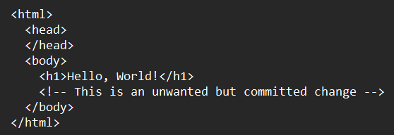
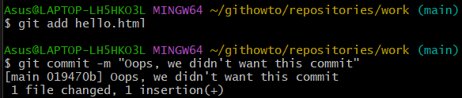

### 2) Use the diff command
The `diff` command shows changes between the working directory and the repository version.  
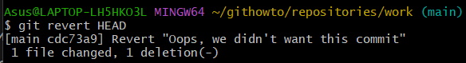

### 3) Stage the changes
Use the `git add` command to stage the changes, then check the status.  
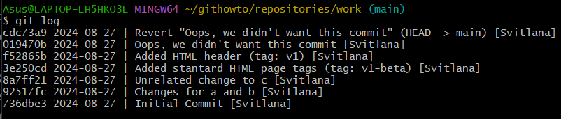

## 15. Ignoring files

### 1) Create and edit .gitignore
Create the `.gitignore` file. Add the `temp` directory and any files in it to `.gitignore`.  
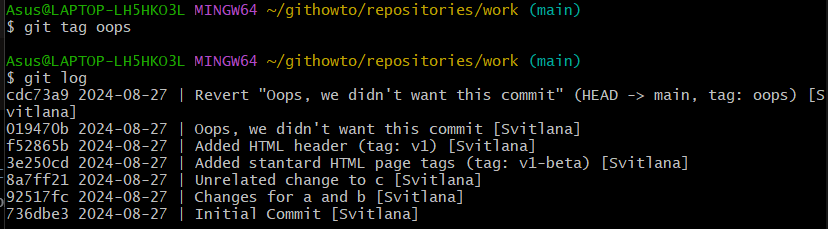

### 2) Check the status
Check the status.  
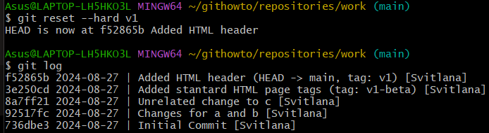

### 3) Add .gitignore to the repository
Stage and commit the `.gitignore` file.  
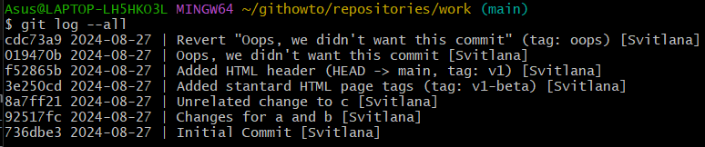

### 4) Check the status again
Run `git status` again to verify that the ignored files and directories are not being tracked.  

## 16. Configuring your repository

### 1) Change your username
Use the `git config` command to change your username and email for this repository.  
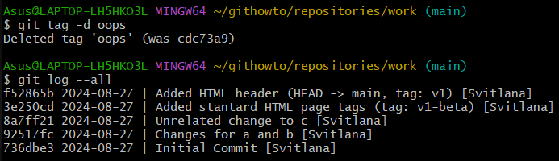

### 2) Check the configuration
Use the `git config --list` command to verify that the configuration has been changed.  

## 17. Aliases

### 1) Creating an alias for status
Create an alias for the `git status` command, so you can use `git st`.  

### 2) Test the alias
Run the new alias to verify that it works.  
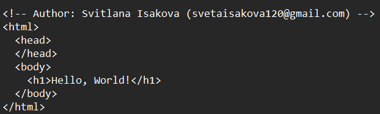

## 18. Branching

### 1) Check the current branch
Use the `git branch` command to check which branch you're currently on.  
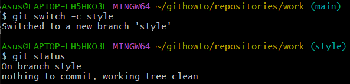

### 2) Create a new branch
Create a new branch called `feature`.  

### 3) Check branches again
Check the list of branches.  

### 4) Switch to the new branch
Use the `git switch` command to switch to the `feature` branch.  

## 19. Merging

### 1) Commit changes in feature branch
Make changes to `hello.html` and commit them to the `feature` branch.  
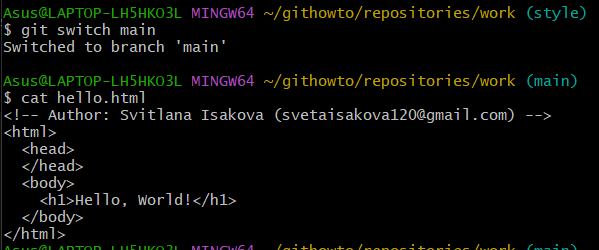

### 2) Switch back to the main branch
Use the `git switch` command to return to the `main` branch.  
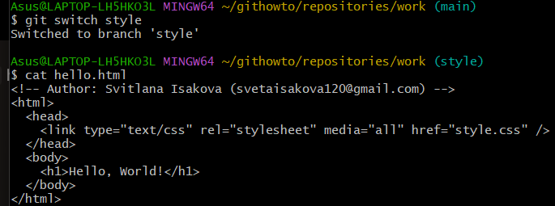

### 3) Merge the feature branch
Use the `git merge` command to merge the `feature` branch into the `main` branch.  

### 4) Resolve merge conflicts (if any)
If there are merge conflicts, Git will notify you. Manually resolve them by editing the file(s), then add and commit the changes.  

### 5) Check the merge result
After resolving conflicts, check the status and log to ensure the merge is successful.  

## 20. Rebasing

### 1) Create and switch to a new branch
Create a new branch called `experiment` and switch to it.  
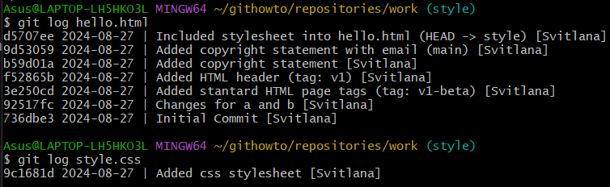

### 2) Make changes in the experiment branch
Edit `hello.html` in the `experiment` branch and commit the changes.  
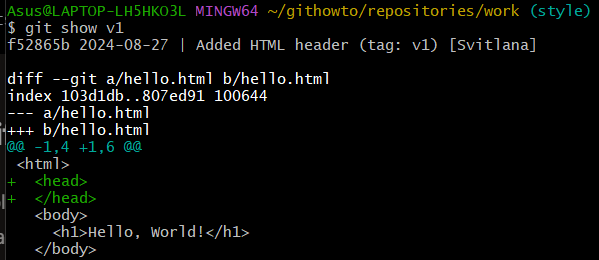

### 3) Switch back to the feature branch
Switch back to the `feature` branch.  

### 4) Rebase the feature branch onto experiment
Use the `git rebase` command to rebase the `feature` branch onto the `experiment` branch.  

### 5) Resolve any rebase conflicts
If there are conflicts, manually resolve them and continue the rebase process.  

### 6) Check the rebase result
Check the status and log to ensure the rebase was successful.  

## 21. Stashing changes

### 1) Make changes without committing
Make changes to `hello.html` without committing them.  
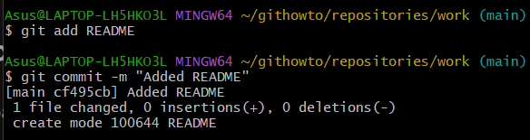

### 2) Stash the changes
Use the `git stash` command to temporarily save the changes.  

### 3) Check the status
Check the status to verify that the changes have been stashed.  

### 4) Apply the stash
Use the `git stash apply` command to retrieve the stashed changes.  

### 5) Commit the stashed changes
After applying the stash, commit the changes.  

## 22. Deleting branches

### 1) Delete a branch after merging
After successfully merging the `feature` branch into `main`, delete the `feature` branch.  
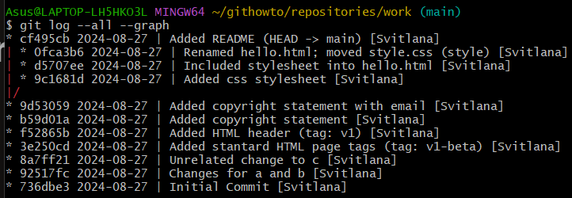

### 2) Check the list of branches
Check the list of branches to ensure the `feature` branch has been deleted.  

## 23. Working with remotes

### 1) Add a remote repository
Use the `git remote add` command to add a remote repository.  
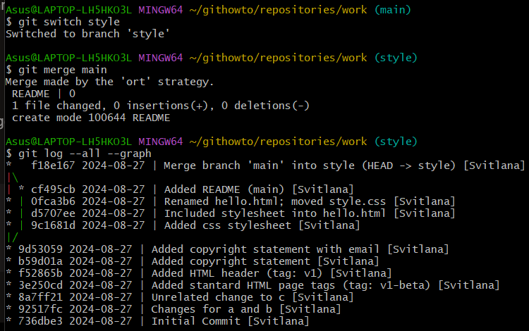

### 2) Push to the remote
Push the `main` branch to the remote repository.  

### 3) Pull from the remote
Use the `git pull` command to fetch and merge changes from the remote repository.  

### 4) View remote repositories
Use the `git remote -v` command to view the list of remote repositories.  

### 5) Remove a remote
Use the `git remote remove` command to remove a remote repository.  

## 24. Cloning a repository

### 1) Clone a remote repository
Use the `git clone` command to clone a remote repository to your local machine.  

### 2) Check the cloned repository
After cloning, navigate to the cloned directory and check its contents.  
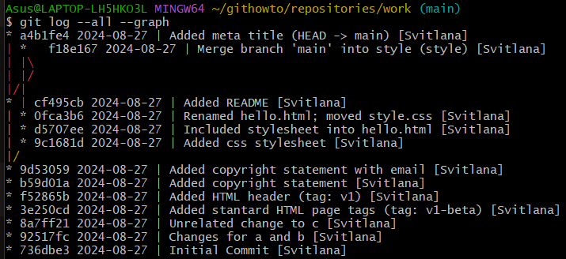

## 25. Forking a repository

### 1) Fork a repository on GitHub
Navigate to the repository on GitHub and use the "Fork" button to fork it to your account.  

### 2) Clone your forked repository
Once forked, clone the repository to your local machine using `git clone`.  
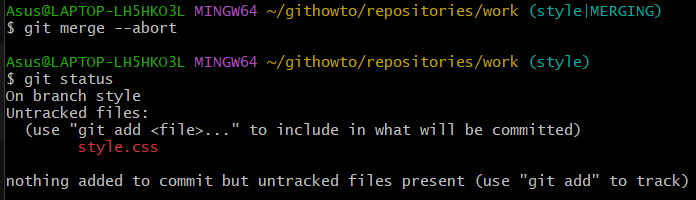

### 3) Add the original repository as a remote
After cloning, add the original repository as an additional remote to fetch updates.  
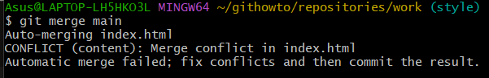

## 26. Fetching and pulling updates from the original repository

### 1) Fetch updates from the original repository
Use the `git fetch` command to retrieve updates from the original repository (which you've added as a remote).  

### 2) Merge updates into your local branch
Once fetched, merge the updates into your current branch using `git merge`.  

## 27. Contributing to an open-source project

### 1) Make changes in a forked repository
After forking and cloning a repository, make changes locally and commit them.  

### 2) Push changes to your forked repository
Push the changes to your forked repository on GitHub using `git push`.  
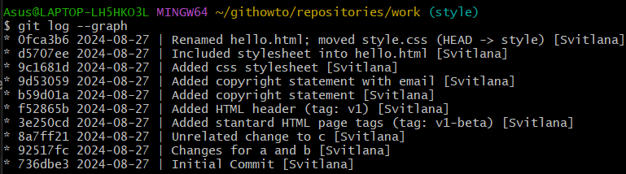

### 3) Open a pull request
Once the changes are pushed, open a pull request on GitHub to propose your changes to the original repository.  

## 28. Resetting changes

### 1) Make changes to a file
Make some changes to `hello.html` but don't commit them.  

### 2) Use git reset
Use `git reset --hard` to discard the changes.  

### 3) Check the status
After resetting, check the status to ensure the working directory is clean.  

## 29. Reverting commits

### 1) Make a commit with changes
Make a commit with some changes to `hello.html`.  

### 2) Use git revert
Use `git revert` to undo the changes made in the commit, creating a new commit that reverts the previous changes.  

### 3) Check the log
After reverting, check the log to see the new commit that undoes the previous one.  

## 30. Cherry-picking commits

### 1) Create a new branch
Create a new branch where you'll apply selected commits.  
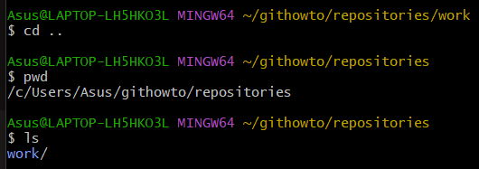

### 2) Use git cherry-pick
Use the `git cherry-pick` command to apply specific commits from another branch to the current one.  
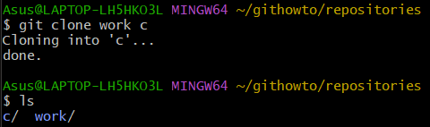

### 3) Check the result
After cherry-picking, check the log to ensure the selected commit(s) have been applied to the current branch.  

## 31. Using tags

### 1) Create a new tag
Use the `git tag` command to create a new tag for the current commit.  
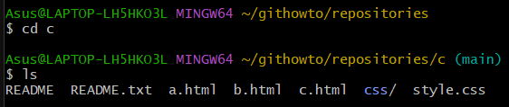

### 2) View tags
Use the `git tag` command to view all tags in the repository.  
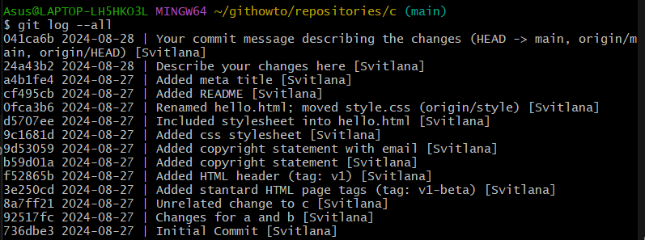

### 3) Push tags to the remote
Use `git push --tags` to push the created tags to the remote repository.  

## 32. Deleting a tag

### 1) Delete a tag locally
Use the `git tag -d` command to delete a tag locally.  
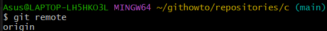

### 2) Delete a tag on the remote
Use `git push origin --delete tagname` to delete a tag from the remote repository.  
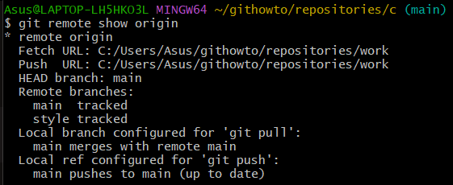

## 33. Using submodules

### 1) Add a submodule
Use `git submodule add` to add a submodule to your repository.  
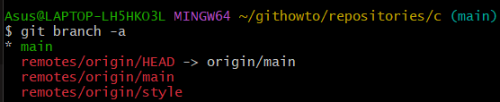

### 2) Initialize and update submodules
After cloning a repository with submodules, run `git submodule init` and `git submodule update` to initialize and update them.  

### 3) Remove a submodule
To remove a submodule, use the `git rm` command and delete the relevant entries in `.gitmodules` and `.git/config`.  

## 34. Working with large files

### 1) Track large files with Git LFS
Install Git LFS and use the `git lfs track` command to track large files.  

### 2) Push large files
After tracking, add and commit the large files, then push them to the remote repository using Git LFS.  

### 3) Check LFS objects
Use `git lfs ls-files` to list files being tracked by Git LFS.  

## 35. Rewriting history with git rebase

### 1) Start an interactive rebase
Use `git rebase -i HEAD~n` to start an interactive rebase where `n` is the number of commits to modify.  
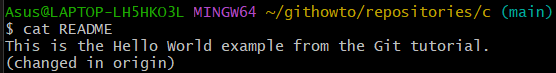

### 2) Pick and squash commits
In the interactive rebase editor, choose which commits to pick or squash by editing the file.  

### 3) Complete the rebase
Once you've made your changes, save and close the editor to apply the rebase.  

## 36. Resolving merge conflicts

### 1) Create a conflicting situation
Modify the same line in a file on two different branches, then attempt to merge the branches.  
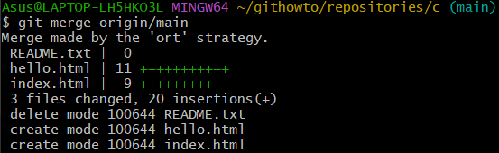

### 2) View the conflict
Git will detect the conflict and notify you about it. Open the file to see the conflict markers.  
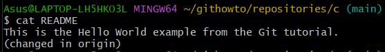

### 3) Resolve the conflict
Manually resolve the conflict by editing the file, then add and commit the resolved file.  

## 37. Stashing changes

### 1) Stash uncommitted changes
Use `git stash` to temporarily store uncommitted changes in a stash.  
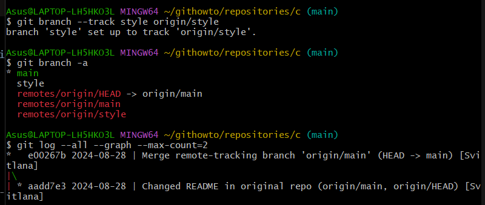

### 2) View stash list
Use `git stash list` to see all stashed changes.  

### 3) Apply stashed changes
Use `git stash apply` to apply the stashed changes back to your working directory.  

## 38. Bisecting to find bugs

### 1) Start git bisect
Use `git bisect start` to start a bisect session. Mark the current commit as bad and a known good commit.  
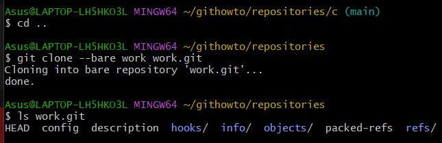

### 2) Mark commits
Mark each commit as good or bad during the bisect process until you find the problematic commit.  

### 3) End bisect
Once the bad commit is identified, use `git bisect reset` to end the bisect session.  

## 39. Using hooks

### 1) Install a hook
Navigate to the `.git/hooks/` directory and create or modify a hook script such as `pre-commit` or `post-commit`.  

### 2) Test the hook
Make changes to your code and commit them to trigger the hook.  

## 40. Signing commits

### 1) Configure GPG for commit signing
Set up GPG on your machine and use `git config --global user.signingkey your-key-id` to configure signing.  

### 2) Sign commits
Use `git commit -S` to sign a commit with your GPG key.  

### 3) Verify signed commits
Use `git log --show-signature` to verify that commits have been properly signed.  

## 41. Using git blame

### 1) Blame a file
Use `git blame filename` to see who last modified each line of the file.  

### 2) Explore specific changes
In the output, you can see the commit hash and author responsible for each line.  

## 42. Generating a patch

### 1) Create a patch file
Use `git format-patch` to generate patch files for a range of commits.  

### 2) Apply a patch
Use `git apply` to apply a patch file to the repository.  

## 43. Working with GitHub Actions

### 1) Set up a GitHub Actions workflow
Create a `.github/workflows/` directory and add a YAML file to define a GitHub Actions workflow.  

### 2) Push changes to trigger the workflow
Push your changes to GitHub, and the defined workflow will automatically run.  

### 3) View workflow results
Navigate to the "Actions" tab on GitHub to see the results of the workflow execution.  

## 44. Managing multiple remotes

### 1) Add a new remote
Use `git remote add` to add a new remote repository.  

### 2) Fetch from multiple remotes
You can use `git fetch` to retrieve updates from any of the configured remotes.  

### 3) Push to a specific remote
Use `git push remote-name` to push changes to a specific remote repository.  

