# Part I: Git basics

## 2. Creating a project

### 1) Create a “Hello, World!” page
I started with an empty directory and added an empty subdirectory called `work` and then created a `hello.html` file in it.  

### 2) Create a repository
So there is a directory that contains one file. Ran `git init` to create a Git repository from this directory.  
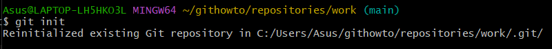

### 3) Add the page to the repository
Now let's add the “Hello, World” page to the repository.  
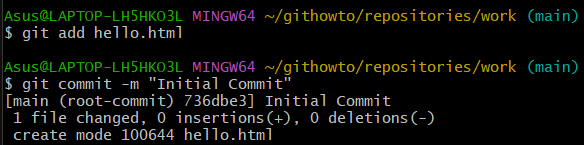

## 3. Checking the status of the repository

### 1) Check the status of the repository
Use the `git status` command to check the current state of the repository.  
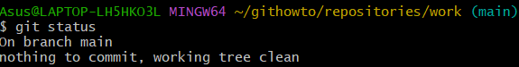

## 4. Making changes

### 1) Checking the status
Check the working directory’s status.  
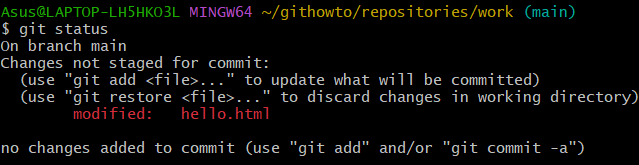  
Git knows `hello.html` has been changed, but these changes are not yet committed to the repository.

## 5. Staging the changes

### 1) Adding changes
Now command Git to stage changes. Check the status.  
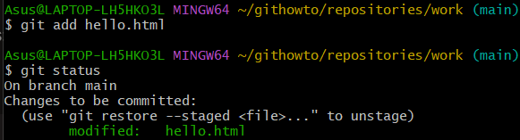  
Changes to the `hello.html` have been staged. This means that Git knows about the change, but it is not permanent in the repository.

## 6. Staging and committing
I edited three files (`a.html`, `b.html`, and `c.html`). After that, I committed the changes so that the changes in `a.html` and `b.html` are in a single commit:  
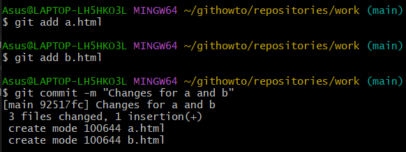  
The changes in `c.html` are not logically related to the first two files, so they are made in a separate commit.  
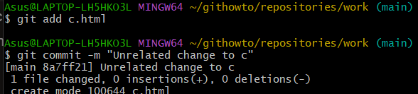

## 7. Committing the changes

### 1) Committing changes. Checking the status
Let us commit now and check the status.  
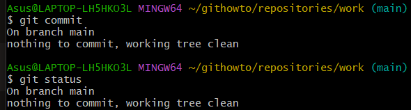  
The working directory is clean, you can continue working.

## 8. Changes, not files

### 1) First Change: Adding default page tags
Change the "Hello, World" page so that it contains default tags `<html>` and `<body>`.  
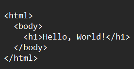

### 2) Add this change
Now add this change to the Git staging.  

### 3) Second change: Add the HTML headers
Now add the HTML headers (`<head>` section) to the "Hello, World" page.  
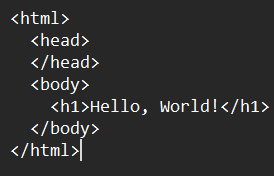

### 4) Check the current status
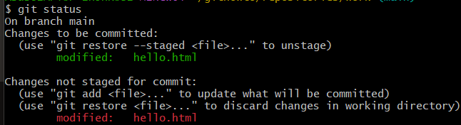

### 5) Commit
Commit the staged changes, then check the status one more time.  
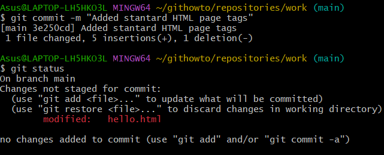  
The status command suggests that `hello.html` still has unrecorded changes, but the staging area is already clear.

### 6) Adding the second change
Add the second change to the staging area, and run the `git status` command.  
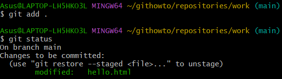

### 7) Commit the second change
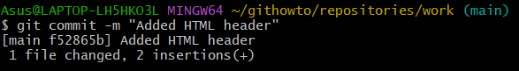

## 9. History
Getting a list of changes made is a function of the `git log` command.  
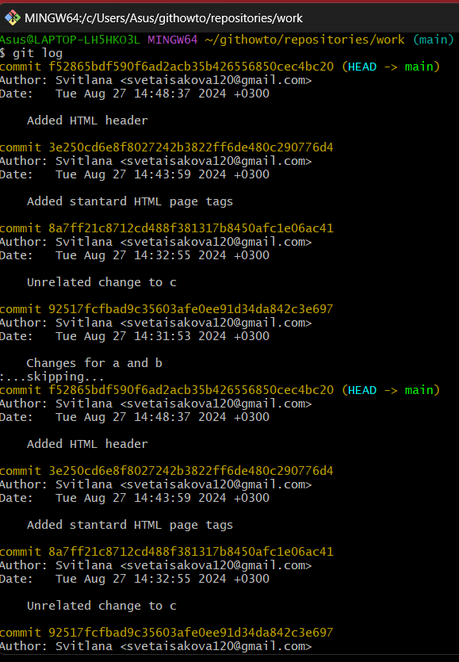

### 1) One line history
You have full control over how the log is displayed. The one-line format helps show this.  
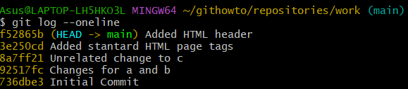

### 2) Controlling the display of entries
Here are some other interesting options for viewing history:  
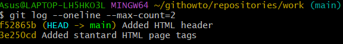  
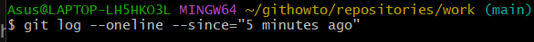  
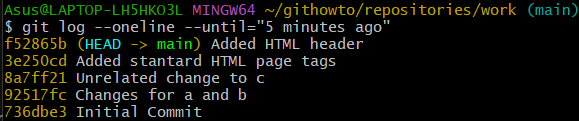  
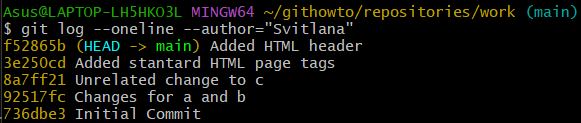  
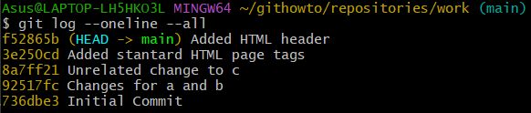

### 3) Getting fancy
This is what you should use to view changes made in the last week. I added `--author=Svitlana` to see only my changes.  
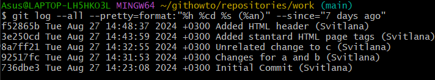

### 4) The ultimate format of the log
The following log format is most appropriate.  
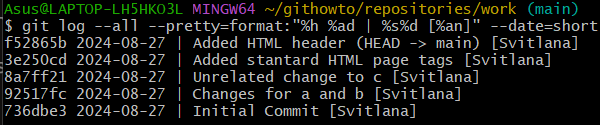  
Every time you want to see a log, you'll have to do a lot of typing. Fortunately, there are several Git config options to adjust the default log output format.  
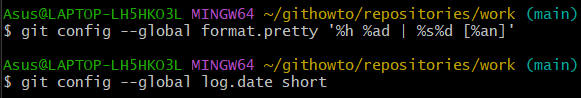

## 10. Getting older versions

### 1) Getting hashes of the previous commit
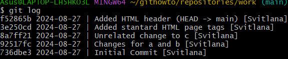  
Check the log data and find the hash of the initial commit.  
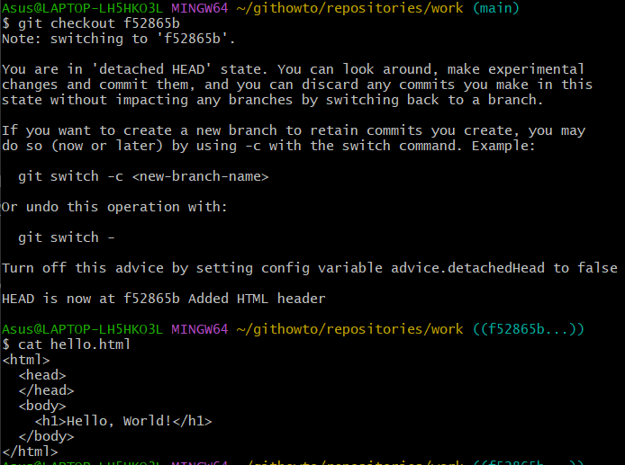

### 2) Returning to the latest version in the main branch
To return to the latest version of our code, we need to switch to the default `main` branch. We can use the `switch` command to switch between branches.  
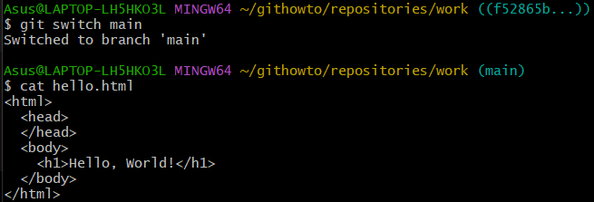

## 11. Tagging versions

### 1) Creating a tag for the first version
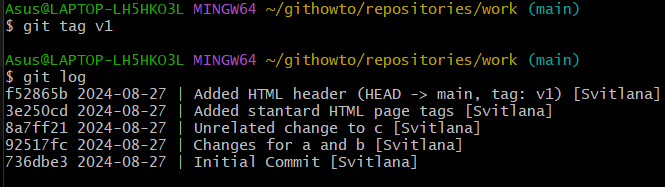

### 2) Tags for previous versions
Let's tag the version prior to the current version with the name `v1-beta`. First of all, we will check out the previous version using the `^` notation.  
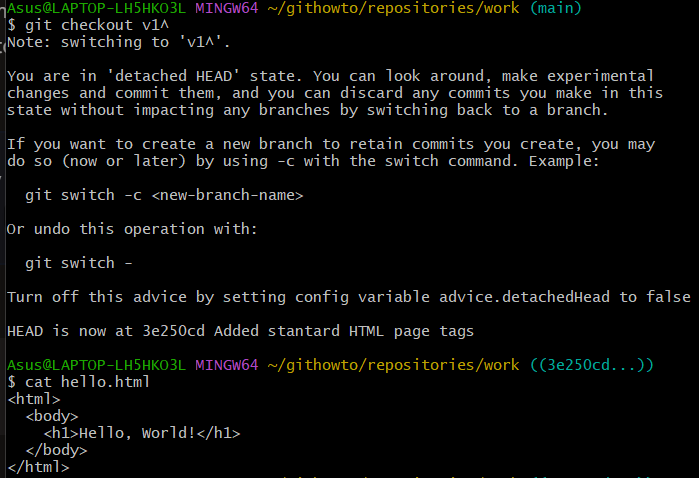  
This is the version with `<html>` and `<body>` tags but without `<head>`. Let’s make it the `v1-beta` version.  
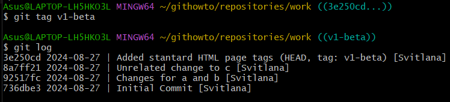

### 3) Check out by the tag name
Now try to check out between the two tagged versions.  
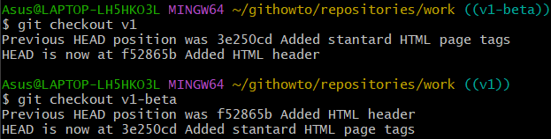

### 4) Viewing tags with the tag command
You can see the available tags using the `git tag` command.

### 5) Viewing tags in logs
You can also check for tags in the log.  
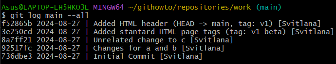

## 12. Discarding local changes (before staging)

### 1) Change hello.html
Make changes to the `hello.html` file in the form of an unwanted comment.

### 2) Check the status
Check the working directory’s status.  
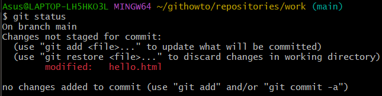  
We see that the `hello.html` file has been modified, but not staged yet.

### 3) Undoing the changes in the working directory
Use the `checkout` command to check out the repository's version of the `hello.html` file.  
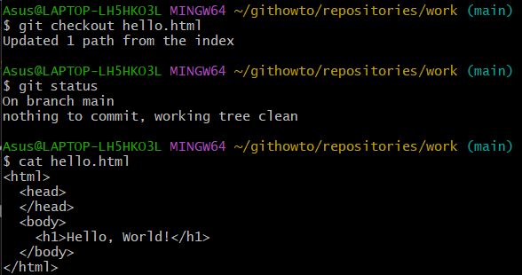  
The status command shows there were no unstaged changes in the working directory, and the "bad comment" is no longer contained in the file.

## 13. Cancel staged changes (before committing)

### 1) Edit file and stage changes
Make changes to the `hello.html` file in the form of an unwanted comment.  
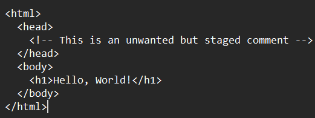

### 2) Check the status
Stage the modified file. Check the status of unwanted changes.  
  
Status shows that the change has been staged and is ready to commit.

### 3) Reset the staging area
The `reset` command resets the staging area to `HEAD`. This clears the staging area from the changes that we have just staged.  
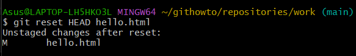  
The reset command does not change the working directory. Therefore, the working directory still contains unwanted comments.

### 4) Switch to commit version
We can use the `checkout` command to remove unwanted changes from the working directory.  
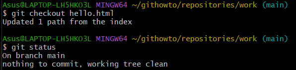
