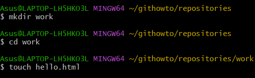

<h1>Part I: Git basics<h1>

<h2>2. Creating a project</h2>
<h3>1) Create a “Hello, World!” page</h3>
I started with an empty directory and added an empty subdirectory called work and then created a hello.html file in it. 
<h3>2) Create a repository</h3>
So there is a directory that contains one file. Ran git init to create a Git repository from this directory. <a href="screenshots/2.2.png">Screenshot 2.2</a>
<h3>3) Add the page to the repository</h3>
Now let's add the “Hello, World” page to the repository. <a href="screenshots/2.3.png">Screenshot 2.3</a>

<h2>3. Checking the status of the repository</h2>
<h3>1) Check the status of the repository</h3>
Use the git status command, to check the current state of the repository. <a href="screenshots/3.1.png">Screenshot 3.1</a>

<h2>4. Making changes</h2>
<h3>1)Checking the status</h3>
Check the working directory’s status. <a href="screenshots/4.1.png">Screenshot 4.1</a> The first important aspect here is that Git knows hello.html file has been changed, but these changes are not yet committed to the repository.

<h2>5. Staging the changes</h2>
<h3>1)Adding changes</h3>
Now command Git to stage changes. Check the status. <a href="screenshots/5.1.png">Screenshot 5.1</a> Changes to the hello.html have been staged. This means that Git knows about the change, but it is not permanent in the repository. The next commit will include the changes staged.

<h2>6. Staging and committing</h2>
I edited three files (a.html, b.html and c.html). After that, you need to commit all the changes so that the changes in a.html and b.html are a single commit <a href="screenshots/6.1.png">Screenshot 6.1</a>, and the changes in c.html are not logically related to the first two files and are made in a separate commit. <a href="screenshots/6.2.png">Screenshot 6.2</a>

<h2>7. Committing the changes</h2>
<h3>1) Committing changes. Checking the status</h3>
Let us commit now and check the status. <a href="screenshots/7.1.png">Screenshot 7.1</a> The working directory is clean, you can continue working.

<h2>8. Changes, not files</h2>
<h3>1) First Change: Adding default page tags</h3>
Change the "Hello, World" page so that it contained default tags <html> and <body>. <a href="screenshots/8.1.png">Screenshot 8.1</a>
<h3>2) Add this change</h3>
Now add this change to the Git staging. <a href="screenshots/8.2.png">Screenshot 8.2</a>
<h3>3) Second change: Add the HTML headers</h3>
Now add the HTML headers (<head> section) to the "Hello, World" page. <a href="screenshots/8.3.png">Screenshot 8.3</a>
<h3>4) Check the current status</h3>
<a href="screenshots/8.4.png">Screenshot 8.4</a>
<h3>5) Commit
Commit the staged changes, then check the status one more time. <a href="screenshots/8.5.png">Screenshot 8.5</a> The status command suggests that hello.html still has unrecorded changes, but the staging area is already clear.
<h3>6) Adding the second change</h3>
Add the second change to the staging area, after that run the git status command. <a href="screenshots/8.6.png">Screenshot 8.6</a>
<h3>7) Commit the second change</h3>
<a href="screenshots/8.7.png">Screenshot 8.7 </a>

<h2>9. History</h2>
Getting a list of changes made is a function of the git log command. <a href="screenshots/9.0.png">Screenshot 9.0</a>
<h3>1) One line history</h3>
You have full control over how the log is displayed. The one-line format helps show this. <a href="screenshots/9.1.png">Screenshot 9.1</a>
<h3>2) Controlling the display of entries</h3>
Here are some other interesting options for viewing history:
<a href="screenshots/9.2.1.png">Screenshot 9.2.1</a>
<a href="screenshots/9.2.2.png">Screenshot 9.2.2</a>
<a href="screenshots/9.2.3.png">Screenshot 9.2.3</a>
<a href="screenshots/9.2.4.png">Screenshot 9.2.4</a>
<a href="screenshots/9.2.5.png">Screenshot 9.2.5</a>
<h3>3) Getting fancy</h3>
This is what you should use to view changes made in the last week. I added --author=Svitlana if I want to see only my changes. <a href="screenshots/9.3.png">Screenshot 9.3</a>
<h3>4) The ultimate format of the log</h3>
The following log format is most appropriate. <a href="screenshots/9.4.1png">Screenshot 9.4.1</a>
Every time you want to see a log, you'll have to do a lot of typing. Fortunately, there are several Git config options to adjust the default log output format. <a href="screenshots/9.4.2png">Screenshot 9.4.2</a>

<h2>10. Getting older versions</h2>
<h3>1) Getting hashes of the previous commit</h3>
<a href="screenshots/10.1.1.png">Screenshot 10.1.1</a>
Check the log data and find the hash of the initial commit. <a href="screenshots/10.1.2.png">Screenshot 10.1.2</a>
<h3>2) Returning to the latest version in the main branch</h3>
To return to the latest version of our code, we need to switch to the default main branch. We can use the switch command to switch between branches.<a href="screenshots/10.2.png">Screenshot 10.2</a>

<h2>11. Tagging versions</h2>
<h3>1) Creating a tag for the first version</h3>
<a href="screenshots/11.1.png">Screenshot 11.1</a>
<h3>2) Tags for previous versions</h3>
Let's tag the version prior to the current version with the name v1-beta. First of all we will check out the previous version. Instead of looking up the hash of the commit, we are going to use the ^ notation, specifically v1^, indicating the commit previous to v1. <a href="screenshots/11.2.1.png">Screenshot 11.2.1</a>
This is the version with <html> and <body> tags, but without <head>. Let's make it’s the v1-beta version. <a href="screenshots/11.2.2.png">Screenshot 11.2.2</a>
<h3>3) Check out by the tag name</h3>
Now try to check out between the two tagged versions. <a href="screenshots/11.3.png">Screenshot 11.3</a>
<h3>4) Viewing tags with the tag command</h3>
You can see the available tags using the git tag command.
<h3>5) Viewing tags in logs</h3>
You can also check for tags in the log. <a href="screenshots/11.5.png">Screenshot 11.5</a>

<h2>12. Discarding local changes (before staging)</h2>
<h3>1) Change hello.html</h3>
Make changes to the hello.html file in the form of an unwanted comment. 
<h3>2) Check the status</h3>
First of all, check the working directory’s status. <a href="screenshots/12.2.png">Screenshot 12.2</a> We see that the hello.html file has been modified, but not staged yet.
<h3>3) Undoing the changes in the working directory</h3>
Use the checkout command in order to check out the repository's version of the hello.html file. <a href="screenshots/12.3.png">Screenshot 12.3</a> The status command shows there were no unstaged changes in the working directory. And the "bad comment" is no longer contained in the file.

<h2>13. Cancel staged changes (before committing)</h2>
<h3>1) Edit file and stage changes</h3>
Make changes to the hello.html file in the form of an unwanted comment. <a href="screenshots/13.1.png">Screenshot 13.1</a>
<h3>2) Check the status</h3>
Stage the modified file. Check the status of unwanted changes. <a href="screenshots/13.2.png">Screenshot 13.2</a> Status shows that the change has been staged and is ready to commit.
<h3>3) Reset the staging area</h3>
The reset command resets the staging area to HEAD. This clears the staging area from the changes that we have just staged. <a href="screenshots/13.3.png">Screenshot 13.3</a> The reset command (default) does not change the working directory. Therefore, the working directory still contains unwanted comments. 
<h3>4) Switch to commit version</h3>
We can use the checkout command to remove unwanted changes from working directory. <a href="screenshots/13.4.png">Screenshot 13.4</a>

<h2>14. Cancelling commits</h2>
<h3>1) Edit the file and make a commit</h3>
Replace hello.html with the following file. <a href="screenshots/14.1.1.png">Screenshot 14.1.1</a>
<a href="screenshots/14.1.2.png">Screenshot 14.1.2</a>
<h3>2) Make a commit with new changes that discard previous changes</h3>
To cancel the commit, we need to create a commit that deletes the changes saved by unwanted commit. <a href="screenshots/14.2.png">Screenshot 14.2</a>
<h3>3) Check the log</h3>
Checking the log shows the unwanted cancellations and commits in our repository. <a href="screenshots/14.3.png">Screenshot 14.3</a>

<h2>15. Removing a commit from a branch</h2>
<h3>1) Mark this branch first</h3>
Let us do a quick scan of our commit history. Let us mark the last commit with tag, so you can find it after removing a commit(s). <a href="screenshots/15.1.png">Screenshot 15.1</a>
<h3>2) Reset commit to before oops</h3>
As the branch has a tag, we can use the tag name in the reset command. <a href="screenshots/15.2.png">Screenshot 15.2</a> Our main branch is pointing at commit v1 and the "Revert Oops" and "Oops" commits no longer exist in the branch. The --hard parameter makes the working directory reflect the new branch head.
<h3>3) Nothing is ever lost</h3>
What happened to the wrong commits? They are still in the repository. Actually, we can still refer to them. Let us take a look at all commits. <a href="screenshots/15.3.png">Screenshot 15.3</a> We can see that the wrong commits are not gone. They are not listed in the main branch anymore but still remain in the repository. They would still be in the repository if we did not tag them, but then we could reference them only by their hashes.

<h2>16. Removing the oops tag</h2>
<h3>1) Removal of the oops tag</h3>
The oops tag has performed its function. Let us remove that tag and permit the garbage collector to delete referenced commit. <a href="screenshots/16.1.png">Screenshot 16.1</a> The oops tag will no longer appear in the repository.

<h2>17. Amending commits</h2>
<h3>1) Change the page and commit</h3>
Put an author comment on the page. <a href="screenshots/17.1.1.png">Screenshot 17.1.1</a>
<a href="screenshots/17.1.2.png">Screenshot 17.1.2</a>
<h3>2) Oops... email required</h3>
After making the commit you understand that every good comment should include the author's email. Edit the hello.html page to provide an email. <a href="screenshots/17.2.png">Screenshot 17.2</a>
<h3>3) Change the previous commit</h3>
We do not want to create another commit for adding the email address. Let us change the previous commit and add an email address. <a href="screenshots/17.3.png">Screenshot 17.3</a>
<h3>4) View history</h3>
The new "author/email" commit replaces the original "author" commit. The same effect can be achieved by resetting the last commit in the branch, and recommitting new changes. <a href="screenshots/17.4.png">Screenshot 17.4</a>

<h2>18. Creating a branch</h2>
<h3>1) Create a branch</h3>
It is time to make our page more stylish with a touch of CSS. We'll develop this feature in a new branch called style. <a href="screenshots/18.1.png">Screenshot 18.1</a>
<h3>2) Add the style.css file</h3>
<a href="screenshots/18.2.1.png">Screenshot 18.2.1</a> <a href="screenshots/18.2.2.png">Screenshot 18.2.2</a>
<h3>3) Change hello.html to use style.css</h3>
<a href="screenshots/18.3.1.png">Screenshot 18.3.1</a> <a href="screenshots/18.3.2.png">Screenshot 18.3.2</a>

<h2>19. Switching branches</h2>
Now our project has two branches. <a href="screenshots/19.0.png">Screenshot 19.0</a>
<h3>1) Switching to the main branch</h3>
To switch between branches, use the git switch command. <a href="screenshots/19.1.png">Screenshot 19.1</a>
<h3>2) Let us return to the style branch</h3>
We are back to the style branch. As you can see, our CSS-related changes are present. <a href="screenshots/19.2.png">Screenshot 19.2</a>

<h2>20. Moving files</h2>
<h3>1) Examining the history of changes in a specific file</h3>
Let's take a look at the change log for the hello.html file before we proceed with renaming it. <a href="screenshots/20.1.png">Screenshot 20.1</a>
<h3>2) Comparing different versions of a specific file</h3>
The show command is used to display the changes in a specific commit. Let's examine the changes in the hello.html file in the commit tagged with v1. <a href="screenshots/20.2.png">Screenshot 20.2</a>
<h3>3) Renaming hello.html</h3>
Let's proceed to rename our hello.html file to index.html using the standard mv command and observe the outcome. <a href="screenshots/20.3.1.png">Screenshot 20.3.1</a> Git interprets our modification as if we've deleted the file and created a new one. We need to inform Git that we've renamed the file, not deleted and created a new one. <a href="screenshots/20.3.2.png">Screenshot 20.3.2</a>
<h3>4) Safely moving style.css</h3>
Let's move our style.css file to the css directory. This time, however, we'll use the git mv command to ensure the move is recorded in Git's history as a move, not as a deletion and addition of a new file. <a href="screenshots/20.4.1.png">Screenshot 20.4.1</a> Now, let's commit our changes and examine the change history of the css/styles.css file. To see the file's history prior to its relocation, we'll need to include the --follow option. Let's execute both versions of the command to understand the difference. <a href="screenshots/20.4.2.png">Screenshot 20.4.2</a>

<h2>21. Changes in the main branch</h2>
<h3>1) Commit the README file to the main branch</h3>
We are currently in the style branch. The README file is not part of this branch, so we must switch to the main branch before committing the changes. <a href="screenshots/21.1.png">Screenshot 21.1</a>

<h2>21. Viewing diverging branches</h2>
<h3>1) View current branches</h3>
We now have two diverging branches in the repository. Use the following log command to view the branches and how they diverge. <a href="screenshots/22.1.png">Screenshot 22.1</a>

<h2>23. Merging</h2>
<h3>1) Merge the branches</h3>
Merging brings changes from two branches into one. Let us go back to the style branch and merge it with main. <a href="screenshots/23.1.png">Screenshot 23.1</a>

<h2>24. Creating a merge conflict</h2>
<h3>1) Switch back to the main and create conflict</h3>
In our main branch, the page is still called hello.html. Switch back to the main branch and make the following changes. <a href="screenshots/24.1.1.png">Screenshot 24.1.1</a> <a href="screenshots/24.1.2.png">Screenshot 24.1.2</a>
<h3>2) View branches</h3>
After the "Added README" commit, the main branch has been merged with the style branch, but there is an additional main commit, which was not merged back to the style branch. <a href="screenshots/24.2.png">Screenshot 24.2</a>

<h2>25. Resolving conflicts</h2>
<h3>1) Merge the main branch into the style branch</h3>
Let us return to the style branch and merge in all the recent changes from the main. <a href="screenshots/25.1.1.png">Screenshot 25.1.1</a> It seems that we have a conflict. Let us see what Git has to say about it. <a href="screenshots/25.1.2.png">Screenshot 25.1.2</a> If you open the index.html you will see. <a href="screenshots/25.1.3.png">Screenshot 25.1.3</a>
<h3>2) Aborting merge</h3>
Jumping straight to the conflict resolution may not be a best strategy. The conflict may be caused by the changes you are unaware of. Or the changes are too significant to address right away. For this reason, Git allows you to abort the merge and return to the state before the merge. To do that, you can use the git merge --abort command, as suggested by status command we ran earlier. <a href="screenshots/25.2.png">Screenshot 25.2</a>
<h3>3) Resolving the conflict</h3>
After some meditation, we are ready to handle the conflict. Let us rerun the merge. <a href="screenshots/25.3.png">Screenshot 25.3</a>
<h3>4) Commit the resolved conflict</h3>
Let us look at the current state of our repository and make sure that everything is okay. <a href="screenshots/25.4.png">Screenshot 25.4</a>

<h2>27. Resetting the style branch</h2>
<h3>1) Resetting the style branch</h3>
Let us go to the style branch to the point before we had merged it with the main branch. We can reset the branch to any commit. In fact, the reset command can change the branch pointer to point to any commit in the tree. Here, we want to go back in the style branch to a point before merging with the main. We have to find the last commit before the merge. <a href="screenshots/27.1.1.png">Screenshot 27.1.1</a> We can see from the output that the "Renamed hello.html; moved style.css" commit was the latest on the style branch prior to the first merging with main. Let us reset the style branch to this commit. To reference that commit, we either use its hash, or deduct that this commit is 2 commits before the HEAD, or HEAD~2 in Git notation. <a href="screenshots/27.1.2.png">Screenshot 27.1.2</a>
<h3>2) Check the branch</h3>
Now, let's check the log of the style branch. There should be no merge commits in the log. <a href="screenshots/27.2.png">Screenshot 27.2</a>

<h2>28. Rebase</h2>
<h3>1) Rebase the style branch onto main </h3>
<a href="screenshots/28.1.1.png">Screenshot 28.1.1</a> Note that the conflict is in hello.html, not in index.html as the last time. It is because rebase was in the process of applying the style changes on top of the main branch. The file hello.html hasn't been renamed in main yet, so it still has its old name. When merging, we would have a "reverse" conflict. During the merge, the changes of the main branch are applied on top of the style branch. The style branch has the file renamed, so the conflict would be in index.html. <a href="screenshots/28.1.2.png">Screenshot 28.1.2</a>
<h3>2) Resolve the conflict</h3>
The conflict itself can be resolved in the same way we did before. First, we edit the hello.html file to meet our expectations. But after that, we don't need to commit the changes. We can just add the file to the index and continue the rebase process. It allows me to fix conflicts without creating a bunch of ugly merge conflicts. For simplicity's sake, we can add all files using ., which stands for the path of the current directory. Git interprets this as "add all files in the current directory and its subdirectories". <a href="screenshots/28.2.1.png">Screenshot 28.2.1</a> Upon saving changes, Git will finish the rebase process, and we can proceed with the following commands. <a href="screenshots/28.2.2.png">Screenshot 28.2.2</a>

<h1>Part II: Working with multiple repositories<h1>

<h2>30. Cloning repositories</h2>
<h3>1) Go to your repositories directory</h3>
At this point you should be in your repositories directory. It should contain a single repository named work. <a href="screenshots/30.1.png">Screenshot 30.1</a>
<h3>2) Create a clone of the work repository</h3>
Let's create a clone of the repository. <a href="screenshots/30.2.png">Screenshot 30.2</a>

<h2>31. Examine the cloned repository</h2>
<h3>1) Viewing the cloned repository</h3>
Let's have a look at our cloned repository. <a href="screenshots/31.1.png">Screenshot 31.1</a> We will see a list of all files in the top level of the original repository .
<h3>2) View the history of the cloned repository</h3>
We will see a list of all the commits in the new repository, and it should match the commit history of the original repository. The only difference should be in the names of the branches. <a href="screenshots/31.2.png">Screenshot 31.2</a>

<h2>32. What is origin?</h2>
<a href="screenshots/32.1.png">Screenshot 32.1</a> We see that the cloned repository knows the default name of the remote repository. To get more information about origin. <a href="screenshots/31.2.png">Screenshot 31.2</a> We can see that the origin of the remote repository is the original work repo. Remote repos are typically stored on a separate machine or a centralized server. However, as we see, they can also point to a repository on the same machine.

<h2>33. Remote branches</h2>
Let's take a look at the branches in our cloned repository. <a href="screenshots/33.0.png">Screenshot 33.0</a> As we can see only the main branch is listed in it. git branch only lists the local branches by default.
<h3>1) List of the remote branches</h3>
To see all the branches, need to use the following command. <a href="screenshots/33.1.png">Screenshot 33.1</a> Git lists all the branches from the original repo, but the remote repository branches are not treated as local ones. 

<h2>34. Changing the original repository</h2>
<h3>1) Make a change in the original work repository</h3>
<a href="screenshots/34.1.1.png">Screenshot 34.1.1</a> We are now in the work repository.
Make the following changes to the README file. <a href="screenshots/34.1.2.png">Screenshot 34.1.2</a> Now add and commit this change. <a href="screenshots/34.1.3.png">Screenshot 34.1.3</a>

<h2>35. Fetching changes</h2>
<a href="screenshots/35.0.png">Screenshot 35.0</a> We are now in the home repository.
<h3>1) Check the README</h3>
We can show that the cloned README file has not been changed. <a href="screenshots/35.1.png">Screenshot 35.1</a> No changes, as you can see.

<h2>36. Merging pulled changes</h2>
<h3>1) Merge the pulled changes into the local main branch</h3>
<a href="screenshots/36.1.png">Screenshot 36.1</a>
<h3>2) Check the README again</h3>
Now we should see the changes. <a href="screenshots/36.2.png">Screenshot 36.2</a> These are the changes. 

<h2>37. Adding a tracking branch</h2>
<h3>1) Add a local branch tracking the remote branch</h3>
<a href="screenshots/37.1.png">Screenshot 37.1</a> Now we can see the style branch in the branch list and log.

<h2>38. Bare repos</h2>
<h3>1) Creating a bare repository.</h3>
<a href="screenshots/38.1.png">Screenshot 38.1</a> Now we are in the repositories directory. The convention is that repositories ending in .git are bare repositories. We can see that there is no working directory in the work.git repo. Essentially it is nothing but the .git directory of a regular repo.

<h2>39. Adding a remote repository</h2>
Let's add the work.git repository to our original repository. <a href="screenshots/39.0.png">Screenshot 39.0</a>

<h2>40. Pushing changes</h2>
Let’s start by creating a change to be pushed. Edit the README and commit it. <a href="screenshots/40.0.1.png">Screenshot 40.0.1</a> <a href="screenshots/40.0.2.png">Screenshot 40.0.2</a>  Now send changes to the shared repository. <a href="screenshots/40.0.3.png">Screenshot 40.0.3</a> The shared repository is the one receiving changes sent by us.

<h2>41. Pulling shared changes</h2>
Quickly switch to the home repository and pull the changes we just sent to the shared repository. <a href="screenshots/41.0.1.png">Screenshot 41.0.1</a> Continue with... <a href="screenshots/41.0.2.png">Screenshot 41.0.2</a>

<h2>42. Hosting your Git repository</h2>
<h3>1) Launch the Git server</h3>
<a href="screenshots/42.1.1.png">Screenshot 42.1.1</a> Now, go to your repositories directory in a separate terminal window. <a href="screenshots/42.1.2.png">Screenshot 42.1.2</a> You will find a copy of the work project.
