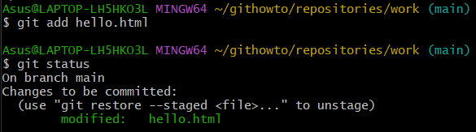
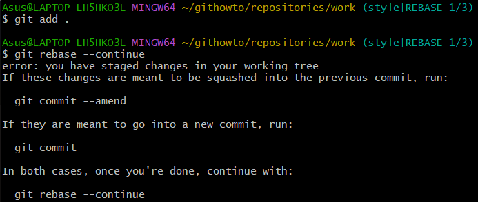

# Part I: Git Basics

## 2. Creating a Project

### 1) Create a “Hello, World!” Page
I started with an empty directory and added an empty subdirectory called `work`, then created a `hello.html` file in it.  

### 2) Create a Repository
So there is a directory that contains one file. I ran `git init` to create a Git repository from this directory.  

### 3) Add the Page to the Repository
Now let's add the “Hello, World!” page to the repository.  

## 3. Checking the Status of the Repository

### 1) Check the Status of the Repository
Use the `git status` command to check the current state of the repository.  

## 4. Making Changes

### 1) Checking the Status
Check the working directory’s status.  
  
The first important aspect here is that Git knows the `hello.html` file has been changed, but these changes are not yet committed to the repository.

## 5. Staging the Changes

### 1) Adding Changes
Now command Git to stage changes. Check the status.  
  
Changes to the `hello.html` file have been staged. This means that Git knows about the change, but it is not permanent in the repository. The next commit will include the changes staged.

## 6. Staging and Committing

I edited three files (`a.html`, `b.html`, and `c.html`). After that, you need to commit all the changes so that the changes in `a.html` and `b.html` are a single commit.  
  
The changes in `c.html` are not logically related to the first two files and are made in a separate commit.  

## 7. Committing the Changes

### 1) Committing Changes. Checking the Status
Let us commit now and check the status.  
  
The working directory is clean, and you can continue working.

## 8. Changes, Not Files

### 1) First Change: Adding Default Page Tags
Change the "Hello, World" page so that it contains default tags `<html>` and `<body>`.  

### 2) Add This Change
Now add this change to the Git staging.  

### 3) Second Change: Add the HTML Headers
Now add the HTML headers (`<head>` section) to the "Hello, World" page.  

### 4) Check the Current Status

### 5) Commit
Commit the staged changes, then check the status one more time.  
  
The status command suggests that `hello.html` still has unrecorded changes, but the staging area is already clear.

### 6) Adding the Second Change
Add the second change to the staging area, and then run the `git status` command.  

### 7) Commit the Second Change

## 9. History

Getting a list of changes made is a function of the `git log` command.  

### 1) One Line History
You have full control over how the log is displayed. The one-line format helps show this.  

### 2) Controlling the Display of Entries
Here are some other interesting options for viewing history:  
  
  
  
  

### 3) Getting Fancy
This is what you should use to view changes made in the last week. I added `--author=Svitlana` if I want to see only my changes.  

### 4) The Ultimate Format of the Log
The following log format is most appropriate.  
  
Every time you want to see a log, you'll have to do a lot of typing. Fortunately, there are several Git config options to adjust the default log output format.  

## 10. Getting Older Versions

### 1) Getting Hashes of the Previous Commit
  
Check the log data and find the hash of the initial commit.  

### 2) Returning to the Latest Version in the Main Branch
To return to the latest version of our code, we need to switch to the default main branch. We can use the `switch` command to switch between branches.  

## 11. Tagging Versions

### 1) Creating a Tag for the First Version

### 2) Tags for Previous Versions
Let's tag the version prior to the current version with the name `v1-beta`. First of all, we will check out the previous version. Instead of looking up the hash of the commit, we are going to use the `^` notation, specifically `v1^`, indicating the commit previous to `v1`.  
  
This is the version with `<html>` and `<body>` tags, but without `<head>`. Let's make it the `v1-beta` version.  

### 3) Check Out by the Tag Name
Now try to check out between the two tagged versions.  

### 4) Viewing Tags with the Tag Command
You can see the available tags using the `git tag` command.

### 5) Viewing Tags in Logs
You can also check for tags in the log.  

## 12. Discarding Local Changes (Before Staging)

### 1) Change hello.html
Make changes to the `hello.html` file in the form of an unwanted comment.
  

### 2) Check the Status
First of all, check the working directory’s status.  
  
We see that the `hello.html` file has been modified, but not staged yet.

### 3) Undoing the Changes in the Working Directory
Use the `checkout` command in order to check out the repository's version of the `hello.html` file.  
  
The status command shows there were no unstaged changes in the working directory, and the "bad comment" is no longer contained in the file.

## 13. Cancel Staged Changes (Before Committing)

### 1) Edit File and Stage Changes
Make changes to the `hello.html` file in the form of an unwanted comment.  

### 2) Check the Status
Stage the modified file. Check the status of unwanted changes.  
  
The status shows that the change has been staged and is ready to commit.

### 3) Reset the Staging Area
The `reset` command resets the staging area to `HEAD`. This clears the staging area from the changes that we have just staged.  
  
The `reset` command (default) does not change the working directory. Therefore, the working directory still contains unwanted comments.

### 4) Switch to Commit Version
We can use the `checkout` command to remove unwanted changes from the working directory.  

## 14. Cancelling Commits

### 1) Edit the File and Make a Commit
Replace `hello.html` with the following file.  
  

### 2) Make a Commit with New Changes that Discard Previous Changes
To cancel the commit, we need to create a commit that deletes the changes saved by the unwanted commit.  

### 3) Check the Log
Checking the log shows the unwanted cancellations and commits in our repository.  

## 15. Removing a Commit from a Branch

### 1) Mark This Branch First
Let us do a quick scan of our commit history. Let us mark the last commit with a tag, so you can find it after removing a commit(s).  

### 2) Reset Commit to Before Oops
As the branch has a tag, we can use the tag name in the reset command.  
  
Our main branch is pointing at commit `v1`, and the "Revert Oops" and "Oops" commits no longer exist in the branch. The `--hard` parameter makes the working directory reflect the new branch head.

### 3) Nothing is Ever Lost
What happened to the wrong commits? They are still in the repository. Actually, we can still refer to them. Let us take a look at all commits.  
  
We can see that the wrong commits are not gone. They are not listed in the main branch anymore but still remain in the repository. They would still be in the repository if we did not tag them, but then we could reference them only by their hashes.

## 16. Removing the Oops Tag

### 1) Removal of the Oops Tag
The oops tag has performed its function. Let us remove that tag and permit the garbage collector to delete the referenced commit.  
  
The oops tag will no longer appear in the repository.

## 17. Amending Commits

### 1) Change the Page and Commit
Put an author comment on the page.  
  

### 2) Oops... Email Required
After making the commit, you understand that every good comment should include the author's email. Edit the `hello.html` page to provide an email.  

### 3) Change the Previous Commit
We do not want to create another commit for adding the email address. Let us change the previous commit and add an email address.  

### 4) View History
The new "author/email" commit replaces the original "author" commit. The same effect can be achieved by resetting the last commit in the branch and recommitting new changes.  

## 18. Creating a Branch

### 1) Create a Branch
It is time to make our page more stylish with a touch of CSS. We'll develop this feature in a new branch called `style`.  

### 2) Add the style.css File
  

### 3) Change hello.html to Use style.css
  

## 19. Switching Branches

Now our project has two branches.  

### 1) Switching to the Main Branch
To switch between branches, use the `git switch` command.  

### 2) Let Us Return to the Style Branch
We are back to the `style` branch. As you can see, our CSS-related changes are present.  

## 20. Moving Files

### 1) Examining the History of Changes in a Specific File
Let's take a look at the change log for the `hello.html` file before we proceed with renaming it.  

### 2) Comparing Different Versions of a Specific File
The `show` command is used to display the changes in a specific commit. Let's examine the changes in the `hello.html` file in the commit tagged with `v1`.  

### 3) Renaming hello.html
Let's proceed to rename our `hello.html` file to `index.html` using the standard `mv` command and observe the outcome.  
  
Git interprets our modification as if we've deleted the file and created a new one. We need to inform Git that we've renamed the file, not deleted and created a new one.  

### 4) Safely Moving style.css
Let's move our `style.css` file to the `css` directory. This time, however, we'll use the `git mv` command to ensure the move is recorded in Git's history as a move, not as a deletion and addition of a new file.  
  
Now, let's commit our changes and examine the change history of the `css/styles.css` file. To see the file's history prior to its relocation, we'll need to include the `--follow` option. Let's execute both versions of the command to understand the difference.  

## 21. Changes in the Main Branch

### 1) Commit the README File to the Main Branch
We are currently in the `style` branch. The `README` file is not part of this branch, so we must switch to the `main` branch before committing the changes.  

## 22. Viewing Diverging Branches

### 1) View Current Branches
We now have two diverging branches in the repository. Use the following log command to view the branches and how they diverge.  

## 23. Merging

### 1) Merge the Branches
Merging brings changes from two branches into one. Let us go back to the `style` branch and merge it with `main`.  

## 24. Creating a Merge Conflict

### 1) Switch Back to the Main and Create Conflict
In our `main` branch, the page is still called `hello.html`. Switch back to the `main` branch and make the following changes.  
  

### 2) View Branches
After the "Added README" commit, the `main` branch has been merged with the `style` branch, but there is an additional `main` commit, which was not merged back to the `style` branch.  

## 25. Resolving Conflicts

### 1) Merge the Main Branch into the Style Branch
Let us return to the `style` branch and merge in all the recent changes from `main`.  
  
It seems that we have a conflict. Let us see what Git has to say about it.  
  
If you open the `index.html`, you will see.  
  

### 2) Aborting Merge
Jumping straight to the conflict resolution may not be the best strategy. The conflict may be caused by changes you are unaware of, or the changes are too significant to address right away. For this reason, Git allows you to abort the merge and return to the state before the merge. To do that, you can use the `git merge --abort` command, as suggested by the status command we ran earlier.  
  

### 3) Resolving the Conflict
After some meditation, we are ready to handle the conflict. Let us rerun the merge.  
  

### 4) Commit the Resolved Conflict
Let us look at the current state of our repository and make sure that everything is okay.  

## 27. Resetting the Style Branch

### 1) Resetting the Style Branch
Let us go to the `style` branch to the point before we had merged it with the `main` branch. We can reset the branch to any commit. In fact, the `reset` command can change the branch pointer to point to any commit in the tree. Here, we want to go back in the `style` branch to a point before merging with the `main`. We have to find the last commit before the merge.  
  
We can see from the output that the "Renamed hello.html; moved style.css" commit was the latest on the `style` branch prior to the first merging with `main`. Let us reset the `style` branch to this commit. To reference that commit, we either use its hash or deduce that this commit is 2 commits before the `HEAD`, or `HEAD~2` in Git notation.  
  

### 2) Check the Branch
Now, let's check the log of the `style` branch. There should be no merge commits in the log.  

## 28. Rebase

### 1) Rebase the Style Branch onto Main
  
Note that the conflict is in `hello.html`, not in `index.html` as the last time. It is because rebase was in the process of applying the style changes on top of the main branch. The file `hello.html` hasn't been renamed in `main` yet, so it still has its old name. When merging, we would have a "reverse" conflict. During the merge, the changes of the `main` branch are applied on top of the `style` branch. The `style` branch has the file renamed, so the conflict would be in `index.html`.  
  

### 2) Resolve the Conflict
The conflict itself can be resolved in the same way we did before. First, we edit the `hello.html` file to meet our expectations. But after that, we don't need to commit the changes. We can just add the file to the index and continue the rebase process. This allows us to fix conflicts without creating a bunch of ugly merge commits. For simplicity's sake, we can add all files using `.` which stands for the path of the current directory. Git interprets this as "add all files in the current directory and its subdirectories".  
  
Upon saving changes, Git will finish the rebase process, and we can proceed with the following commands.  

# Part II: Working with Multiple Repositories

## 30. Cloning Repositories

### 1) Go to Your Repositories Directory
At this point, you should be in your repositories directory. It should contain a single repository named `work`.  

### 2) Create a Clone of the Work Repository
Let's create a clone of the repository.  

## 31. Examine the Cloned Repository

### 1) Viewing the Cloned Repository
Let's have a look at our cloned repository.  
  
We will see a list of all files in the top level of the original repository.

### 2) View the History of the Cloned Repository
We will see a list of all the commits in the new repository, and it should match the commit history of the original repository. The only difference should be in the names of the branches.  

## 32. What is Origin?

  
We see that the cloned repository knows the default name of the remote repository. To get more information about origin, see below.  
  
We can see that the origin of the remote repository is the original work repo. Remote repos are typically stored on a separate machine or a centralized server. However, as we see, they can also point to a repository on the same machine.

## 33. Remote Branches

Let's take a look at the branches in our cloned repository.   
As we can see, only the main branch is listed in it. The `git branch` command only lists the local branches by default.

### 1) List of the Remote Branches

To see all the branches, you need to use the following command.   
Git lists all the branches from the original repo, but the remote repository branches are not treated as local ones.

## 34. Changing the Original Repository

### 1) Make a Change in the Original Work Repository

  
We are now in the work repository. Make the following changes to the README file.  
  
Now add and commit this change.  

## 35. Fetching Changes

  
We are now in the home repository.

### 1) Check the README

We can show that the cloned README file has not been changed.  
  
No changes, as you can see.

## 36. Merging Pulled Changes

### 1) Merge the Pulled Changes into the Local Main Branch

  

### 2) Check the README Again

Now we should see the changes.  
  
These are the changes.

<h2>37. Adding a tracking branch</h2>
<h3>1) Add a local branch tracking the remote branch</h3>
<a href="screenshots/37.1.png">Screenshot 37.1</a> Now we can see the style branch in the branch list and log.

## 38. Bare Repos

### 1) Creating a Bare Repository

  

Now we are in the repositories directory. The convention is that repositories ending in `.git` are bare repositories. We can see that there is no working directory in the `work.git` repo. Essentially, it is nothing but the `.git` directory of a regular repo.

## 39. Adding a Remote Repository

Let's add the `work.git` repository to our original repository. 

## 40. Pushing Changes

Let’s start by creating a change to be pushed. Edit the README and commit it. 
 

Now send changes to the shared repository. 
 
The shared repository is the one receiving changes sent by us.

## 41. Pulling Shared Changes

Quickly switch to the home repository and pull the changes we just sent to the shared repository. 

Continue with... 

## 42. Hosting Your Git Repository

### 1) Launch the Git Server

Now, go to your repositories directory in a separate terminal window. 

You will find a copy of the work project.
